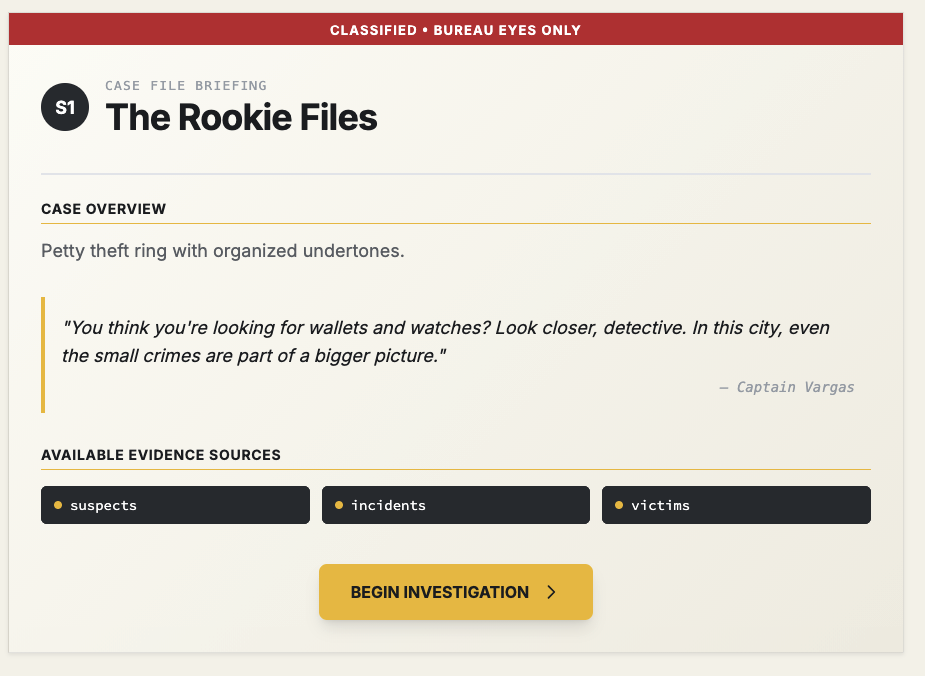

# Introduction

[SQL CASE FILES](https://sqlcasefiles.com/) - A SQL game for interactively practicing your SQL skills. It contains 10 case files with 10 quizzes in each one, totaling 100 quizzes. Below is my journey practicing and having fun with the game. If I make a mistake, it will be corrected with another snippet of SQL code.
# CASE FILE: S01 - The Rookie Files



## Solution

**1) The Usual Suspects**<br>
The Captain needs a roster of potential threats. Retrieve the `name` of every individual currently listed in the `suspects` database.

```SQL
SELECT * FROM suspects
```

**2) Profiling the Perpetrators**<br>
We need to understand who we are dealing with. Retrieve the `name` and `age` for every person in the `suspects` file to build their profiles.

```SQL
SELECT name, age FROM suspects
```

**3) The Victim Pool**<br>
The Chief wants to see the raw data. Retrieve every column (`*`) for all records in the `victims` database so we can review the complete reports.

```SQL
SELECT * FROM victims
```

**4) Scene of the Crime**<br>
Activity is spiking in Union Square. Isolate the reports by finding all incidents where the `location` is 'Union Square'.

```SQL
SELECT * FROM incidents WHERE location = 'Union Square'
```

**5) Juvenile Delinquents**<br>
Intel suggests they are recruiting kids. List the full records of all `suspects` with an `age` less than 18 to identify the minors.

```SQL
SELECT * FROM suspects WHERE age < 18
```

**6) Mapping the Territory**<br>
We need to map their territory. Retrieve a list of unique `location` names from the `incidents` table to see exactly where they operate.

```SQL
SELECT DISTINCT location FROM incidents
```

**7) Standardizing Intelligence**<br>
The DA demands the file be practically court-ready. Retrieve the `name` of every suspect, but alias the column to `Suspect_Name` to match the official paperwork.

```SQL
SELECT name AS Suspect_Name FROM suspects
```

**8) The Latest Hits**<br>
Time is of the essence. Focus on the immediate threat by retrieving the 3 most recent incident reports, sorted by `timestamp` from newest to oldest.

```SQL
SELECT *
FROM incidents
ORDER BY timestamp DESC
LIMIT 3
```

**9) Corroborating the Story**<br>
We need to break his alibi. Find the incident record that places a suspect at 'Fishermans Wharf' (`location`) AND matches `suspect_id` 3.

```SQL
SELECT *
FROM suspects AS s
JOIN incidents AS i ON i.suspect_id = s.suspect_id
WHERE i.location = 'Fishermans Wharf'
AND s.suspect_id = 3
```

**10) The Arrest Warrant**<br>
The judge is ready to sign. Retrieve the complete suspect profile for the individual named 'Tyler Johnson' so we can secure the warrant.

```SQL
SELECT *
FROM suspects
WHERE name = 'Tyler Johnson'
```

# CASE FILE: S02 - Payroll Poison


## Solution

**11) Headcount**<br>
First, let's establish a baseline. Find the total number of employees currently on the official roster and alias the result as `total_employees` so we can compare it against the payroll records.

```SQL
SELECT COUNT(employee_id)
FROM employees
```

**12) The Budget Bleed**<br>
The budget is bleeding dry. Calculate the total monthly expenditure from the `payroll` table and alias it as `total_payroll` to see exactly how much cash is going out the door.

```SQL
SELECT SUM(gross_monthly_pay) AS total_payroll
FROM payroll
```

**13) Department Drift**<br>
A total doesn't tell the whole story. Breakdown the spending by `department`, showing the sum of salaries (aliased as `total_salary`) for each one. Sort by `total_salary` from highest to lowest to identify the biggest burn.

```SQL
SELECT department, SUM(annual_salary) AS total_salary
FROM employees
GROUP BY department -- If you don't use this line it will not show all departments
ORDER BY total_salary DESC
```

**14) The Bloated Budget**<br>
We suspect 'Administration' is padding their numbers. Flag any department with a total `annual_salary` exceeding $750,000. Return the `department` and `total_salary` so we can investigate.

```SQL
SELECT department, SUM(annual_salary) AS total_salary
FROM employees
GROUP BY department
HAVING SUM(annual_salary) > 750000 -- WHERE cannot be used to filter aggregate result
```

**15) Ghost Payment**<br>
The system shows 'inactive' employees, but money is still moving. Trace the payments by linking every employee to their payroll record. Select the employee's `name` and `gross_monthly_pay`, sorted by name.

```SQL
SELECT name, gross_monthly_pay
FROM employees AS e
JOIN payroll AS p ON p.employee_id = e.employee_id
ORDER BY e.name
```

**16) Paying the Dead**<br>
Gotcha. List the unique `name` and `gross_monthly_pay` for every employee who is currently marked 'inactive' but still receiving a paycheck, sorted by name. This is our smoking gun.

```SQL
SELECT DISTINCT name, gross_monthly_pay, status
FROM employees AS e
JOIN payroll AS p ON e.employee_id = p.employee_id
WHERE status = 'inactive'
ORDER BY name
```

**17) The Inside Man**<br>
Let's see if this is just an outlier or a pattern. Calculate the average `annual_salary` for the 'Administration' department, aliasing the result as `average_salary`, to see if they're inflating pay across the board.

```SQL
SELECT department, AVG(annual_salary) AS average_salary
FROM employees
WHERE department = 'Administration'
```

**18) Highest Earner**<br>
We need to know who sits at the top of this pyramid. Find the maximum `annual_salary` in the organization and alias it as `highest_salary`.

```SQL
SELECT employee_id, name, MAX(annual_salary) AS highest_salary
FROM employees
```

**19) Lowest on the Totem Pole**<br>
Contrast is key. Establish the floor by finding the minimum `annual_salary` on the books and aliasing it as `lowest_salary`.

```SQL
SELECT employee_id, name, MIN(annual_salary) AS lowest_salary
FROM employees
```

**20) The Poison Pill**<br>
We have our ghost: Marcus Williams (Employee #15). Quantify the theft by calculating the total sum of `gross_monthly_pay` issued to him, aliasing the total as `total_fraud_amount`. We need a dollar figure for the indictment.

```SQL
-- My query does not match the correct answer, but the logic was right. I was basically doing too much. The next snippet is more efficient.
SELECT e.employee_id,
    e.name,
    '$' || SUM(gross_monthly_pay) AS total_fraud_amount
FROM employees AS e
JOIN payroll AS p ON p.employee_id = e.employee_id
WHERE e.employee_id = 15
```

```SQL
/* The correct version (provide the same logical result with more efficiency since there is no need to use JOIN in this situation.
*/
SELECT SUM(gross_monthly_pay) AS total_fraud_amount 
FROM payroll 
WHERE employee_id = 15;
```

# CASE FILE: S03 - Double Dealer


## Solution

**21) The Vendor Network**<br>
An anonymous tip suggests a cartel. Map the network by linking every vendor to their contracts. Retrieve the vendor `name` and the contract `item` for every deal on file, sorted by vendor name.

```SQL
SELECT name, item
FROM vendors AS v
JOIN contracts AS c ON c.vendor_id = v.vendor_id
ORDER BY v.name
```

**22) The Money Trail**<br>
Follow the paper trail. Retrieve the vendor `name`, `contact_person`, and contract `amount` for every signed agreement, sorted by vendor name, so we can identify the key beneficiaries.

```SQL
SELECT v.name, v.contact_person, c.amount, c.signed_date
FROM vendors AS v
JOIN contracts AS c ON c.vendor_id = v.vendor_id
ORDER BY v.name
```

**23) The Delivery Problem**<br>
We need to connect the dots. List the vendor `name` and contract `item` for every shipment currently marked as 'Missing', sorted by vendor name, to see who is failing to deliver.

```SQL
SELECT v.name, c.item, s.status
FROM vendors AS v
JOIN contracts AS c ON c.vendor_id = v.vendor_id
JOIN shipments AS s ON s.contract_id = c.contract_id
WHERE s.status = 'Missing'
ORDER BY v.name
```

**24) The Repeat Offender**<br>
QuickShip keeps appearing. Audit the low-rated vendors by listing the `name` and contract `amount` for any vendor with a `rating` of 2 or lower. Sort by contract amount from highest to lowest.

```SQL
SELECT v.name, c.amount
FROM vendors AS v
JOIN contracts AS c ON c.vendor_id = v.vendor_id
WHERE v.rating <= 2
ORDER BY c.amount DESC
```

**25) The Inside Connection**<br>
Let's assume Phantom is involved. Reconstruct the timeline by listing the `item` and `signed_date` for every contract awarded to 'Phantom Enterprises', sorted chronologically.

```SQL
SELECT v.name, c.item, c.signed_date
FROM contracts AS c
JOIN vendors AS v ON v.vendor_id = c.vendor_id
WHERE v.name = 'Phantom Enterprises'
ORDER BY c.signed_date ASC
```

**26) The High-Value Targets**<br>
Let's see the big picture. Calculate the total value of all contracts awarded to each vendor, aliasing the sum as `total_contract_value`. Sort by this value from highest to lowest to see who tops the list.

```SQL
SELECT v.name, SUM(c.amount) AS total_contract_value
FROM contracts AS c
JOIN vendors AS v ON v.vendor_id = c.vendor_id
GROUP BY v.name
ORDER BY total_contract_value DESC
```

**27) The Delivery Rate**<br>
Now let's look at performance. Count the number of 'Delivered' shipments for each vendor, aliasing the result as `delivered_count`, sorted alphabetically. We need to know who actually does the work.

```SQL
/*
My query is incorrect because I mistakenly perceive `delivered_count` as delivered result (s.status). But the INNER JOIN was on point!
*/

SELECT DISTINCT v.name, COUNT(s.status) = 'Delivered' AS delivered_count
FROM vendors AS v
JOIN contracts AS c ON v.vendor_id = c.vendor_id
JOIN shipments AS s ON c.contract_id = s.contract_id
GROUP BY v.name
ORDER BY v.name ASC
```

```SQL
-- The correct answer
SELECT v.name, COUNT(s.shipment_id) AS delivered_count 
FROM vendors v 
JOIN contracts c ON v.vendor_id = c.vendor_id 
JOIN shipments s ON c.contract_id = s.contract_id 
WHERE s.status = 'Delivered' 
GROUP BY v.vendor_id, v.name 
ORDER BY v.name;
```

**28) The Contact Network**<br>
Expose the shell game. Find any `contact_person` linked to multiple different vendor records. List their `contact_person` name and the two vendor names (aliased as `vendor1` and `vendor2`). Ensure each pair is listed only once (use `a.name < b.name`).

```SQL
-- My incorrect answer. This is called 'Self JOIN'
SELECT a.contact_person AS vendor1,
       b.contact_person AS vendor2
FROM vendors a, vendors b
WHERE a.name < b.name
```

```SQL
-- The correct answer
SELECT DISTINCT a.contact_person,
a.name AS vendor1, 
b.name AS vendor2 
FROM vendors a 
JOIN vendors b ON a.contact_person = b.contact_person 
WHERE a.vendor_id != b.vendor_id 
AND a.name < b.name;
```

**29) The Timeline Analysis**<br>
Let's check the timing. Analyze the disappearance timeline by listing the contract `item` and `signed_date` for all shipments with a 'Missing' status, sorted by date.

```SQL
SELECT c.item, c.signed_date
FROM contracts AS c
JOIN shipments AS s ON s.contract_id = c.contract_id
WHERE s.status = 'Missing'
ORDER BY c.signed_date ASC
```

**30) The Final Connection**<br>
This is it. Build the final case file for the DA. Generate a report for all high-value contracts (over $50,000), listing the vendor `name`, `contact_person`, contract `amount`, and shipment `status`, ranked by amount from highest to lowest.

```SQL
SELECT v.name,
       v.contact_person,
       c.amount,
       s.status
FROM vendors v
JOIN contracts c ON c.vendor_id = v.vendor_id
JOIN shipments s ON s.contract_id = c.contract_id
WHERE c.amount > 50000
ORDER BY c.amount DESC
```

# CASE FILE: S04 - Disappearing Cargo


## Solution

**31) The Missing Shipments**

The warehouse manager is panicking. Show me exactly what's gone. List the `po_id` and `item_description` for every purchase order that has no corresponding delivery record, sorted by `po_id`.

```SQL
-- My incorrect answer
SELECT p.po_id, p.item_description 
FROM purchase_orders AS p 
JOIN deliveries d ON d.po_id = p.po_id 
JOIN inventory i ON i.po_id = d.po_id 
WHERE p.po_id IS NULL
ORDER BY p.po_id
```

```SQL
-- The correct answer
SELECT 
    p.po_id, 
    p.item_description
FROM purchase_orders AS p
LEFT JOIN deliveries d ON p.po_id = d.po_id
WHERE d.po_id IS NULL
ORDER BY p.po_id;
```

**32) The Phantom Vendors**

We suspect ghost vendors. Expose them by listing the `vendor_name` and `item_description` for every order that was never delivered, sorted by `vendor_name`.

```SQL
SELECT p.vendor_name,
       p.item_description
FROM deliveries AS d
RIGHT JOIN purchase_orders p ON d.po_id = p.po_id
WHERE d.delivery_id IS NULL
ORDER BY p.vendor_name
```

**33) The Value of Nothing**

The Chief needs a number. Quantify the loss by calculating the total value of all undelivered orders (quantity * unit_price) and alias it as `missing_value`.

```SQL
SELECT SUM(quantity * unit_price) AS missing_value
FROM deliveries AS d
RIGHT JOIN purchase_orders p ON d.po_id = p.po_id
WHERE d.delivery_id IS NULL
```

**34) Partial Deliveries**

Interrogation revealed they are skimming off the top. Detect this by listing the `po_id`, `item_description`, `quantity`, and `delivered_quantity` for any order where the delivered amount is less than ordered. Sort by `po_id`.

```SQL
SELECT p.po_id,
       p.item_description,
       p.quantity,
       d.delivered_quantity
FROM purchase_orders AS p
JOIN deliveries d ON d.po_id = p.po_id
WHERE d.delivered_quantity < p.quantity
ORDER BY p.po_id
```

**35) The Inventory Discrepancy**

It's an inside job. Trace the internal theft by listing the `delivery_id` and `item_description` for any shipment that was delivered but never scanned into inventory. Sort by `delivery_id`.

```SQL
SELECT d.delivery_id, p.item_description
FROM purchase_orders AS p
JOIN deliveries d ON d.po_id = p.po_id
LEFT JOIN inventory i ON i.po_id = d.po_id
WHERE i.last_audit IS NULL
ORDER BY d.delivery_id
```

**36) Stock Shrinkage**

The books are cooked. Audit the stock levels by listing the `item_description`, `expected_stock`, and `current_stock` for items where `current_stock` is less than expected. Calculate the difference as `missing`, sorted by `item_description`.

```SQL
SELECT p.item_description, i.expected_stock, i.current_stock, i.expected_stock - i.current_stock AS missing
FROM purchase_orders AS p
JOIN deliveries d ON d.po_id = p.po_id
JOIN inventory i ON i.po_id = d.po_id
WHERE i.current_stock < i.expected_stock
ORDER BY p.item_description
```

**37) The Timeline Gap**

We need to find when the breakdown started. Analyze the timeline gaps by listing the `vendor_name`, `order_date`, and `delivery_date` for every purchase order, sorted by `order_date`.

```SQL
SELECT p.vendor_name, p.order_date, d.delivery_date
FROM purchase_orders AS p
FULL JOIN deliveries d ON d.po_id = p.po_id
ORDER BY p.order_date
```

**38) The Warehouse Leak**

Pinpoint the leaks. Rank the warehouses by loss, showing the `target_warehouse` and the count of **missing** deliveries (`missing_shipments`) for each. Order by `missing_shipments` from highest to lowest.

```SQL
-- My incorrect answer
SELECT p.target_warehouse, COUNT(i.expected_stock - i.current_stock) AS missing_shipments
FROM purchase_orders AS p
FULL JOIN deliveries d ON d.po_id = p.po_id
JOIN inventory i ON i.po_id = d.po_id
GROUP BY p.target_warehouse
ORDER BY missing_shipments DESC
```

```SQL
-- The correct answer
SELECT po.target_warehouse, 
COUNT(po.po_id) AS missing_shipments 
FROM purchase_orders po 
LEFT JOIN deliveries d ON po.po_id = d.po_id
WHERE d.delivery_id IS NULL
GROUP BY po.target_warehouse
ORDER BY missing_shipments DESC;
```

**39) The Vendor Scorecard**

We need a performance review. Scorecard the vendors by listing the `vendor_name`, `total_orders`, `successful_deliveries`, and `total_value`. Rank by successful deliveries, highest to lowest.

```SQL
-- My incorrect answer
SELECT p.vendor_name,
       SUM(p.quantity) AS total_orders,
       COUNT(p.quantity) - 
       COUNT(d.delivered_quantity) AS successful_deliveries,
       p.unit_price * p.quantity AS total_value
FROM purchase_orders AS p
LEFT JOIN deliveries d ON d.po_id = p.po_id
GROUP BY p.vendor_name
ORDER BY successful_deliveries DESC
```

```SQL
-- The correct answer
SELECT po.vendor_name, 
       COUNT(po.po_id) AS total_orders,
       COUNT(d.delivery_id) AS successful_deliveries,
       SUM(po.quantity * po.unit_price) AS total_value 
FROM purchase_orders po 
LEFT JOIN deliveries d ON po.po_id = d.po_id 
GROUP BY po.vendor_name 
ORDER BY successful_deliveries DESC;
```

**40) The Final Audit**

The DA needs everything. Compile the final audit report listing `po_id`, `vendor_name`, `item_description`, `order_value`, `delivery_status`, and `inventory_loss`. Rank by order value descending.

```SQL
-- My incorrect answer
SELECT p.po_id,
       p.vendor_name,
       p.item_description,
       p.quantity * p.unit_price AS order_value,
       COUNT(d.delivery_id) AS delivery_status,
       i.expected_stock - i.current_stock AS inventory_loss
FROM purchase_orders AS p
LEFT JOIN deliveries d ON d.po_id = p.po_id
LEFT JOIN inventory i ON i.po_id = d.po_id
GROUP BY p.vendor_name
ORDER BY order_value DESC;
```

```SQL
-- The correct answer
SELECT po.po_id, 
       po.vendor_name,
       po.item_description,
       po.quantity * po.unit_price AS order_value,
       CASE WHEN d.delivery_id IS NULL 
       THEN 'Not Delivered' ELSE 'Delivered' END AS delivery_status, COALESCE(i.expected_stock - i.current_stock, 0) AS inventory_loss 
FROM purchase_orders po
LEFT JOIN deliveries d ON po.po_id = d.po_id
LEFT JOIN inventory i ON po.po_id = i.po_id
ORDER BY order_value DESC;
```

# CASE FILE: S05 - Pattern of Violence


## Solution

**41) The Repeat Offender**

It's not random. Someone is hitting the city again and again. Identify the repeat offenders by listing the `suspect_id`, `name`, and `incident_count` for any suspect linked to more than one assault. Sort by `incident_count` descending.

```SQL
SELECT i.suspect_id, s.name, COUNT(i.incident_id) AS incident_count
FROM incidents AS i
JOIN suspects s
ON i.suspect_id = s.suspect_id
GROUP BY s.suspect_id, s.name
HAVING incident_count > 1
ORDER BY incident_count DESC
```

**42) The Weapon Pattern**

We need to understand their MO. Analyze the weapon usage patterns by listing the `weapon_used` and the `usage_count` for each type, ranked by frequency.

```SQL
SELECT i.weapon_used, COUNT(i.weapon_used) AS usage_count
FROM incidents AS i
GROUP BY i.weapon_used
ORDER BY usage_count DESC
```

**43) The Time Hunter**

Serial attackers follow a schedule. Predict the next strike by grouping attacks into 'Night' (22:00-06:00), 'Morning' (06:00-12:00), 'Afternoon' (12:00-18:00), and 'Evening' (18:00-22:00). List the `time_period` and `incident_count`, ranked by frequency.

```SQL
/*
At first, I used BETWEEN, but AI suggested that it might overlap
because we're dealing with TIME data here.

Smarter approch here would be putting 'Evening' to ELSE instead of 'Error'
*/
SELECT
CASE
  WHEN time_of_day >= '22:00' OR time_of_day < '06:00' THEN 'Night' -- Use OR to prevent time overlap issue
  WHEN time_of_day >= '06:00' AND time_of_day < '12:00' THEN 'Morning'
  WHEN time_of_day >= '12:00' AND time_of_day < '18:00' THEN 'Afternoon'
  WHEN time_of_day >= '18:00' AND time_of_day < '22:00' THEN 'Evening'
  ELSE 'Error'
END AS time_period,
COUNT(DISTINCT incident_id) AS incident_count
FROM incidents
GROUP BY time_period
ORDER BY incident_count DESC
```

**44) The Victim Profile**

We need a victimology profile. Categorize victims into 'Young Adult' (< 25), 'Adult' (< 35), and 'Older Adult' (35+). For each group, list the `age_group`, `victim_count`, and `avg_age`, ranked by count.

```SQL
SELECT
CASE
  WHEN victim_age < 25 THEN 'Young Adult'
  WHEN victim_age < 35 THEN 'Adult'
  ELSE 'Older Adult'
END AS age_group,
COUNT(incident_id) AS victim_count,
AVG(victim_age)
FROM incidents
GROUP BY age_group
ORDER BY victim_count DESC
```

**45) The Severity Escalation**

Violence is escalating. Track the trend by listing the `suspect_id`, `name`, `avg_severity`, `max_severity`, and `incident_count` for suspects with multiple incidents. Rank by average severity to catch the worst offenders.

```SQL
SELECT s.suspect_id, 
       s.name,
       AVG(i.injury_severity) AS avg_severity,
       MAX(i.injury_severity) AS max_severity,
       COUNT(DISTINCT i.incident_id) AS incident_count
FROM incidents AS i
JOIN suspects s
ON i.suspect_id = s.suspect_id
GROUP BY s.suspect_id -- Need to group by s.name too so it can match
HAVING incident_count > 1
ORDER BY avg_severity DESC
```

```SQL
SELECT s.suspect_id,
       s.name,
       AVG(i.injury_severity) AS avg_severity,
       MAX(i.injury_severity) AS max_severity,
       COUNT(*) AS incident_count 
FROM suspects s 
JOIN incidents i 
ON s.suspect_id = i.suspect_id
GROUP BY s.suspect_id, s.name
HAVING COUNT(*) > 1 
ORDER BY avg_severity DESC;
```

**46) The Location Hunter**

They are hunting in specific zones. Map the grounds by listing the `security_level`, `foot_traffic`, and `incident_count` for each combination, ranked by frequency.

```SQL
-- My incorrect answer (The database is )
SELECT l.security_level,
       l.foot_traffic,
       COUNT(i.incident_id) AS incident_count
FROM locations AS l 
JOIN incidents i ON l.location_id = i.incident_id
GROUP BY l.security_level, l.foot_traffic
ORDER BY incident_count ASC
```

```SQL
-- The correct answer
SELECT l.security_level, 
l.foot_traffic, COUNT(i.incident_id) AS incident_count 
FROM incidents i 
JOIN locations l ON i.location = l.area_name 
GROUP BY l.security_level, l.foot_traffic 
ORDER BY incident_count DESC;
```

*Lesson:* 

- ***The "Hacker" Way:** Join on whatever text matches to get the answer quickly.*
- ***The "Architect" Way:** Use PK/FK to ensure the data is mathematically 100% accurate and lightning-fast.*

**47) The Signature Analysis**

Every predator has a signature. Isolate it for suspect #101 (Marcus Steele). Identify the most common combination of `weapon_used`, `time_period` (Night: 22:00-06:00, else Day), and `victim_type` (Young: < 25, else Older). List the combination and its `pattern_count`, ranked by count.

```SQL
-- My incorrect answer
SELECT i.weapon_used,
    CASE WHEN i.time_of_day >= '22:00:00'
    OR i.time_of_day <= '06:00:00' THEN 'Night' 
    ELSE 'Day' 
  END AS time_period,
    CASE WHEN i.victim_age < 25 THEN 'Young' 
    ELSE 'Older' 
  END AS victim_type,
    COUNT(*) AS pattern_count
FROM incidents AS i
GROUP BY 1, 2, 3
ORDER BY pattern_count DESC;
```

```SQL
-- The correct answer (mostly because I don't understand the challenge correctly)
SELECT weapon_used, 
    CASE WHEN time_of_day >= '22:00' 
    OR time_of_day < '06:00' THEN 'Night'
    ELSE 'Day'
  END AS time_period,
    CASE WHEN victim_age < 25 THEN 'Young' 
    ELSE 'Older'
  END AS victim_type,
  COUNT(*) AS pattern_count
  FROM incidents 
  WHERE suspect_id = 101
  GROUP BY weapon_used, 
  CASE WHEN time_of_day >= '22:00' 
  OR time_of_day < '06:00' THEN 'Night'
  ELSE 'Day' 
  END, 
  CASE WHEN victim_age < 25 THEN 'Young'
  ELSE 'Older'
  END
  ORDER BY pattern_count DESC;
```

**48) The Cooling-Off Period**

Is there a cooling-off period? Check the timeline for suspect #101 by calculating the `incident_count`, `first_incident` ID, and `last_incident` ID to see the full span of his activity.

```SQL
SELECT 
  COUNT(i.incident_id) AS incident_count,
  MIN(i.incident_id) AS first_incident,
  MAX(i.incident_id) AS last_incident
FROM incidents AS i
LEFT JOIN suspects s ON i.suspect_id = s.suspect_id
WHERE s.suspect_id = 101
```

**49) The Accomplice Network**

He might not be working alone. Uncover the network by finding pairs of suspects who share *multiple* location and weapon preferences. List `suspect1`, `suspect2`, and the count of `shared_patterns`, ranked by shared patterns.

```SQL
-- My incorrect answer
SELECT 
    i.suspect_id AS suspect1, 
    s.suspect_id AS suspect2, 
    COUNT(*) AS shared_patterns
FROM incidents AS i
JOIN suspects s 
    ON i.suspect_id = s.suspect_id 
    AND i.location = i.location
GROUP BY suspect1, suspect2
HAVING shared_patterns > 1
ORDER BY shared_patterns DESC;
```

```SQL
-- The correct answer
SELECT 
  i1.suspect_id AS suspect1,
  i2.suspect_id AS suspect2,
  COUNT(*) AS shared_patterns
  FROM incidents i1
  JOIN incidents i2 
  ON i1.location = i2.location 
  AND i1.weapon_used = i2.weapon_used
WHERE i1.suspect_id < i2.suspect_id
GROUP BY i1.suspect_id, i2.suspect_id 
HAVING COUNT(*) > 1
ORDER BY shared_patterns DESC;
```

**50) The Predator Profile**

We have him. Build the final predator profile for Marcus Steele (ID 101). Generate a comprehensive report including `name`, `age`, `arrest_count`, `total_incidents`, `avg_severity`, `max_severity`, `knife_attacks`, `night_attacks`, and `young_victims`.

```SQL
-- My almost correct answer
SELECT s.name, s.age, s.arrest_count, 
       COUNT(DISTINCT i.incident_id) AS total_incidents,
       AVG(i.injury_severity) AS avg_severity,
       MAX(i.injury_severity) AS max_severity,
-- Weapon logic
COUNT(CASE WHEN i.weapon_used = 'Knife' THEN 'knife_attacks'
END) AS knife_attacks,
-- Time logic
COUNT(CASE WHEN i.time_of_day >= '22:00' OR i.time_of_day <= '06:00' THEN 'night_attacks' -- Should use 1 as TRUE
END) AS night_attacks,
-- Age logic
COUNT(CASE WHEN i.victim_age < 25 THEN 'young_victims'
END) AS young_victims

FROM incidents AS i
JOIN suspects s ON i.suspect_id = s.suspect_id
WHERE s.suspect_id = 101
GROUP BY s.name, s.age, s.arrest_count
```

```SQL
-- The correct answer
SELECT s.name, 
       s.age,
       s.arrest_count,
       COUNT(i.incident_id) AS total_incidents,
       AVG(i.injury_severity) AS avg_severity,
       MAX(i.injury_severity) AS max_severity,
       COUNT(CASE WHEN i.weapon_used = 'Knife' THEN 1 END) AS knife_attacks,          COUNT(CASE WHEN i.time_of_day >= '22:00' THEN 1 END) AS night_attacks,         COUNT(CASE WHEN i.victim_age < 25 THEN 1 END) AS young_victims
FROM suspects s
JOIN incidents i ON s.suspect_id = i.suspect_id
WHERE s.suspect_id = 101
GROUP BY s.suspect_id, s.name, s.age, s.arrest_count;
```

# CASE FILE: S06 - Web of Lies


**51) The Network Map**

We've intercepted the dossier. Map the hierarchy by listing the `real_name` of every superior and their subordinate (aliased as `superior` and `subordinate`). Sort by the superior's name.

```SQL
SELECT 
    sup.real_name AS superior, 
    sub.real_name AS subordinate
FROM relationships r
JOIN operatives sup ON r.superior_id = sup.operative_id
JOIN operatives sub ON r.subordinate_id = sub.operative_id
ORDER BY superior
```

**52) The Chain of Command**

Focus on direct orders. Trace the command line by listing the `code_name` of every superior and their subordinate (aliased as `superior` and `subordinate`) linked by a 'Command' relationship. Sort by superior's code name.

```SQL
-- My incorrect answer
SELECT DISTINCT sup.code_name AS superior,
       sub.code_name AS subordinate
FROM relationships AS r
JOIN operatives sup ON r.superior_id = sup.operative_id
JOIN operatives sub ON r.subordinate_id = sub.operative_id 
LEFT JOIN communications c1 ON r.superior_id = c1.comm_id 
LEFT JOIN communications c2 ON r.subordinate_id = c2.comm_id
ORDER BY sup.code_name
```

```SQL
SELECT s.code_name AS superior,
       sub.code_name AS subordinate
FROM relationships r 
JOIN operatives s ON r.superior_id = s.operative_id 
JOIN operatives sub ON r.subordinate_id = sub.operative_id 
WHERE r.relationship_type = 'Command' 
ORDER BY s.code_name;
```

**53) The Communication Web**

The wires are hot. Intercept the chatter by listing the `code_name` of the sender and receiver (aliased as `sender` and `receiver`) along with the `message_type`. Sort by the sender's code name.

```SQL
SELECT s.code_name AS sender,
       r.code_name AS receiver,
       c.message_type
FROM communications AS c
JOIN operatives s ON c.sender_id = s.operative_id
JOIN operatives r ON c.receiver_id = r.operative_id
ORDER BY s.code_name
```

**54) The Recruitment Chain**

We need to find who is bringing them in. Expose the recruitment pipeline by listing the `code_name` of any 'Recruiter' and their 'Scout' or 'Coordinator' subordinate (aliased as `recruiter` and `recruit`), along with the recruit's `role`. Sort by the recruiter's code name.

```SQL
-- r1 = recruiter | r2 = recruit
SELECT 
    r1.code_name AS recruiter,
    r2.code_name AS recruit,
    r2.role AS role
FROM relationships AS r
JOIN operatives AS r1 ON r.superior_id = r1.operative_id
JOIN operatives AS r2 ON r.subordinate_id = r2.operative_id
WHERE r1.role = 'Recruiter'
  AND r2.role IN ('Scout', 'Coordinator')
ORDER BY recruiter;
```

**55) The Enforcement Network**

They work in teams. Identify the muscle by finding pairs of 'Enforcer' operatives linked by a 'Partnership'. List their code names as `enforcer1` and `enforcer2`. Sort by `enforcer1` code name.

```SQL
SELECT sup.code_name AS enforcer1,
       sub.code_name AS enforcer2
FROM relationships AS r
JOIN operatives sup ON r.superior_id = sup.operative_id
JOIN operatives sub ON r.subordinate_id = sub.operative_id
WHERE (sup.role= 'Enforcer' OR sub.role = 'Enforcer')
  AND r.relationship_type = 'Partnership'  
ORDER BY enforcer1;
```