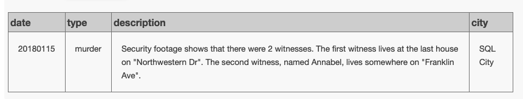
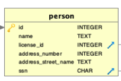
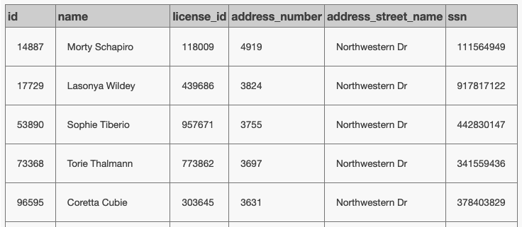
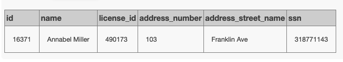
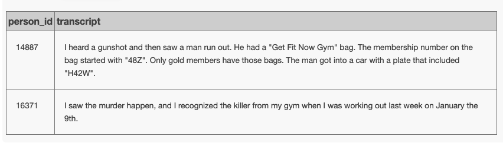
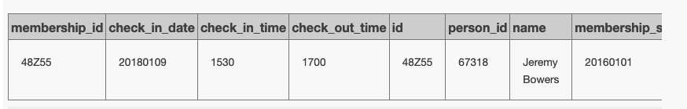
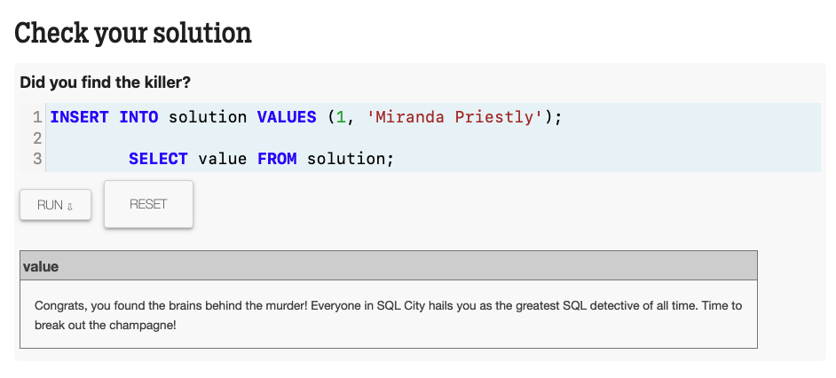

# Introduction
[SQL Murder Mystery](https://mystery.knightlab.com/) is self-direct game for practicing SQL. The site also provide walkthrough guide for those who completely beginner. This game is great and fun! Try it yourself and don't be serious about it. Game meant to be fun with all the freedom you want to do. Below is my journey; the format is informal and may contain some tiny mistakes. We all have our own way of playing this game. I also use Gemini a lot for Q&A, but I never let the AI give away all the fun (solution). This game + AI instruction will boost your SQL learning. Enjoy.
# Detective Memo
## Situation
A crime has taken place, and the detective needs your help. The detective gave you the crime scene report, but you somehow lost it. You vaguely remember that the crime was a **murder** that occurred sometime on **Jan.15, 2018**, and that it took place in **SQL City**. Start by retrieving the corresponding crime scene report from the police department's database.
## Memo
Detective: So, we know 3 things: 
1. What = Murder (type of crime)
2. When = Jan. 15, 2028
3. Where = SQL city

And what we have is a database of the `crime_scene_report` table with others data to follow the trace to the murderer.
### ERD


**Query 1:**
```SQL
SELECT *
FROM crime_scene_report
WHERE type = 'murder'
AND date = 20180115
AND city = 'SQL City'
```

**Result:**


Detective: What do we have here? There was only one record on 20180115 with murder at SQL city which match our evidence above. We need to focus on 2 witnesses and record our data in table format to keep track.

### The Clues Table

| **table** | **Clues**                          | **Witness A**                                                                                                                                                                                                                                   | **Witness B**                                                                                                               |
| --------- | ---------------------------------- | ----------------------------------------------------------------------------------------------------------------------------------------------------------------------------------------------------------------------------------------------- | --------------------------------------------------------------------------------------------------------------------------- |
| person    | id                                 | 14887                                                                                                                                                                                                                                           | 16371                                                                                                                       |
| person    | **Name** (name)                    | NULL (Update: **Morty Schapiro**)                                                                                                                                                                                                               | Annabel (update: **Annabel Miller**)                                                                                        |
| person    | license_id                         | 118009                                                                                                                                                                                                                                          | 490173                                                                                                                      |
| person    | address_number                     | 4919                                                                                                                                                                                                                                            | 103                                                                                                                         |
| person    | **Location** (address_street_name) | Northwestern Dr (the last house)                                                                                                                                                                                                                | Franklin Ave                                                                                                                |
| person    | ssn                                | 111564949                                                                                                                                                                                                                                       | 318771143                                                                                                                   |
| interview | transcript                         | I heard a gunshot and then saw a man run out. **He had a "Get Fit Now Gym" bag**. The membership number on the bag started with **"48Z"**. Only **gold members** have those bags. The man got into a car with a plate that included **"H42W"**. | saw the murder happen, and I recognized the killer from **my gym** when I was working out last week on **January the 9th.** |

Let's start with **Witness A** first whom lives at **the last house on Northwestern Dr**

This is the table we need to focus



**Query 2:**
```SQL
SELECT *
 FROM person
WHERE address_street_name = 'Northwestern Dr'
ORDER BY address_number DESC
```

And the last house according to `address_number` on `Northwestern Dr` street is **"Morty Schapiro"** and we used `ORDER BY address_number DESC` to show the last house. So we going to update the clues table.

**Result:**


The clues table updated. Let's gather data from witness B

**Query 3:**
```SQL
SELECT *
FROM person
WHERE address_street_name = 'Franklin Ave'AND name LIKE '%Annabel%'
```


Now let's update the Clues table. 

We completed the `person` table. Let's move on to other tables to find everything that is related to these 2 witnesses, starting from `interview` table

```SQL
SELECT *
 FROM interview
 WHERE person_id IN (16371, 14887)
```


**Clues:**
- Get Fit Now Gym = get_fit_now_member
- membership_id = start with 48Z
- membership_status = Gold
- drivers_license.plate_number = %H42W%
- get_fit_now_check_in.check_in_date = 20180109

**Query 5:**
```SQL
SELECT *
 FROM get_fit_now_check_in AS c
 JOIN get_fit_now_member AS m ON c.membership_id = m.id
 JOIN person AS p ON m.person_id = p.id
 JOIN drivers_license AS dl ON p.license_id = dl.id
   WHERE m.membership_status = 'gold'
    AND c.membership_id LIKE '48Z%'
    AND c.check_in_date = 20180109
    AND dl.plate_number LIKE '%H42W%'
```

**Result:**


|membership_id|check_in_date|check_in_time|check_out_time|id|person_id|name|membership_start_date|membership_status|id|name|license_id|address_number|address_street_name|ssn|id|age|height|eye_color|hair_color|gender|plate_number|car_make|car_model|
|---|---|---|---|---|---|---|---|---|---|---|---|---|---|---|---|---|---|---|---|---|---|---|---|
|48Z55|20180109|1530|1700|48Z55|67318|Jeremy Bowers|20160101|gold|67318|Jeremy Bowers|423327|530|Washington Pl, Apt 3A|871539279|423327|30|70|brown|brown|male|0H42W2|Chevrolet|Spark LS|

Our suspect is **Jeremy Bowers**, but we need to dig more to find proof.

We havn't look into `facebook_event_checkin` table for the detail that related to the suspect

**Query 6:**
```SQL
SELECT *
FROM get_fit_now_member AS m
JOIN facebook_event_checkin AS fb ON m.person_id = fb.person_id
JOIN interview AS iv ON m.person_id = iv.person_id
WHERE m.person_id = 67318
```

**Result:**

| id    | person_id | name          | membership_start_date | membership_status | person_id | event_id | event_name             | date     | person_id | transcript                                                                                                                                                                                                                                       |
| ----- | --------- | ------------- | --------------------- | ----------------- | --------- | -------- | ---------------------- | -------- | --------- | ------------------------------------------------------------------------------------------------------------------------------------------------------------------------------------------------------------------------------------------------ |
| 48Z55 | 67318     | Jeremy Bowers | 20160101              | gold              | 67318     | 1143     | SQL Symphony Concert   | 20171206 | 67318     | I was hired by a woman with a lot of money. I don't know her name but I know she's around 5'5" (65") or 5'7" (67"). She has red hair and she drives a Tesla Model S. I know that she attended the SQL Symphony Concert 3 times in December 2017. |
| 48Z55 | 67318     | Jeremy Bowers | 20160101              | gold              | 67318     | 4719     | The Funky Grooves Tour | 20180115 | 67318     | I was hired by a woman with a lot of money. I don't know her name but I know she's around 5'5" (65") or 5'7" (67"). She has red hair and she drives a Tesla Model S. I know that she attended the SQL Symphony Concert 3 times in December 2017. |


Transcription from suspect no.1, **Jeremy Bowers**

> I was hired by a woman with a lot of money. I don't know her name but I know she's around 5'5" (65") or 5'7" (67"). She has red hair and she drives a Tesla Model S. I know that she attended the SQL Symphony Concert 3 times in December 2017.

Let's continue, he was a decoy. We extract the clues that link to the DB.

- `driver_license.gender` = Woman
- with a lot of money = `income.annual_income` with ssn as priKey (we can use ORDER BY DESC)
- **Name = NULL**
- Height (`drivers_license.height) = between 65 and 67 inches
- Hair (`drivers_license.hair_color`) = red
- Car (`drivers_license.car_model`) = Tesla Model S 
- Last seen (`facebook_event_checkin.event_name`) = SQL Symphony Concert 3
- When (`facebook_event_checkin.date`)= December 2017

```SQL
SELECT *
FROM person AS p
JOIN drivers_license AS dl ON p.license_id = dl.id
JOIN facebook_event_checkin AS fb ON p.id = fb.person_id
JOIN income AS ic ON p.ssn = ic.ssn
 WHERE dl.height BETWEEN 65 AND 67
    AND dl.hair_color = 'red'
	AND dl.car_make = 'Tesla'
    AND dl.car_model = 'Model S'
    AND fb.event_name LIKE 'SQL Symphony%'
    AND fb.date BETWEEN 20171201 AND 20171231
ORDER BY ic.annual_income DESC;
```

| id    | name             | license_id | address_number | address_street_name | ssn       | id     | age | height | eye_color | hair_color | gender | plate_number | car_make | car_model | person_id | event_id | event_name           | date     | ssn       | annual_income |
| ----- | ---------------- | ---------- | -------------- | ------------------- | --------- | ------ | --- | ------ | --------- | ---------- | ------ | ------------ | -------- | --------- | --------- | -------- | -------------------- | -------- | --------- | ------------- |
| 99716 | Miranda Priestly | 202298     | 1883           | Golden Ave          | 987756388 | 202298 | 68  | 66     | green     | red        | female | 500123       | Tesla    | Model S   | 99716     | 1143     | SQL Symphony Concert | 20171206 | 987756388 | 310000        |
| 99716 | Miranda Priestly | 202298     | 1883           | Golden Ave          | 987756388 | 202298 | 68  | 66     | green     | red        | female | 500123       | Tesla    | Model S   | 99716     | 1143     | SQL Symphony Concert | 20171212 | 987756388 | 310000        |
| 99716 | Miranda Priestly | 202298     | 1883           | Golden Ave          | 987756388 | 202298 | 68  | 66     | green     | red        | female | 500123       | Tesla    | Model S   | 99716     | 1143     | SQL Symphony Concert | 20171229 | 987756388 | 310000        |

Suspect no.2 is **"Miranda Priestly"**. Let's see the interview

There is no interview for person_id 99716 aka Miranda Priestly

So we going to check in with the solution because our decoy provided detailed information that should be enough to investigate her further.



WE GOT HER!!